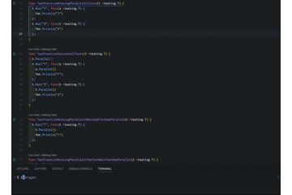

# tparagen
tparagen insert `testing.T.Parallel()` in a test function in a specific source file or in an entire directory.


[](https://github.com/sho-hata/tparagen/actions/workflows/test.yml)

## Background
To run go tests in parallel, you need to insert `testing.T.Parallel()` into the main/sub test you want to run in parallel.

```go
func SampleTest(t *testing.T) {
	t.Parallel()

	testCases := []struct {
		name string
	}{{name: "foo"}}
	for _, tc := range testCases {
		tc := tc
		t.Run(tc.name, func(x *testing.T) {
			x.Parallel()
      // do anything...
		})
	}
}
```

If there is your application in production already, you must add a `testing.T.Parallel()` into any main/sub test. It is a very time-consuming and tedious task.

## Description
tparagen is cli tool for insert `testing.T.Parallel()` into all main/sub test in specified directory.

Before code is below,

```go
package sample

import (
	"fmt"
	"testing"
)

func SampleTest(t *testing.T) {

	testCases := []struct {
		name string
	}{{name: "foo"}}
	for _, tc := range testCases {
		t.Run(tc.name, func(x *testing.T) {
			fmt.Println(tc.name)
		})
	}
}
```

After execute `tparagen`, modified code is below.
```go
package test

import (
	"fmt"
	"testing"
)

func SampleTest(t *testing.T) {
	t.Parallel()

	testCases := []struct {
		name string
	}{{name: "foo"}}
	for _, tc := range testCases {
		tc := tc
		t.Run(tc.name, func(x *testing.T) {
			x.Parallel()
			fmt.Println(tc.name)
		})
	}
}
```

## Demo


## Features
- [x] Insert RunParallel helper function into the main/sub test function.
- [x] is called in the range method and test case variable tc being used, but is not reinitialised

Before code is below,

```go
func SampleTest(t *testing.T) {

	testCases := []struct {
		name string
	}{{name: "foo"}}
	for _, tc := range testCases {
		t.Run(tc.name, func(x *testing.T) {
			fmt.Println(tc.name)
		})
	}
}
```

After execute `tparagen`, modified code is below.
```go
func SampleTest(t *testing.T) {
	t.Parallel()

	testCases := []struct {
		name string
	}{{name: "foo"}}
	for _, tc := range testCases {
		tc := tc
		// ^ tc variable reinitialized
		t.Run(tc.name, func(x *testing.T) {
			x.Parallel()
			fmt.Println(tc.name)
		})
	}
}
```

- [x] Support when called `t.Setenv()` in test
- [x] Ignore specified directories with cli option -i/-ignore.
- Able to ignore main/sub test function by tparagen:ignore comment.

## Synopsis
```
$ tparagen
```

## Options
```
$ tparagen -h
tparagen inserts `testing.T.Parallel()` in a test function in a specific source file or in an entire directory.

Usage of tparagen:
  -i string
        ignore directory names. ex: foo,bar,baz
        (testdata directory is always ignored.)
  -ignore string
        ignore directory names. ex: foo,bar,baz
        (testdata directory is always ignored.)

```
## Installation
```
go install -v github.com/sho-hata/tparagen/cmd/tparagen@latest
```


## Contribution
1. Fork (https://github.com/sho-hata/tparagen/fork)
2. Create a feature branch
3. Commit your changes
4. Rebase your local changes against the master branch
5. Run test suite with the go `test ./...` command and confirm that it passes
6. Run `gofmt -s`
7. Create new Pull Request

## License
[MIT](https://github.com/sho-hata/tparagen/blob/main/LICENSE)

## Author
[sho-hata](https://github.com/sho-hata)
